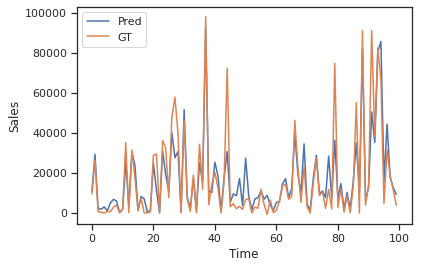

# Walmart-Sales-Forecast-Random-Forest-Grid-Search
A repository forecasting Walmart sales using random forest regression with grid search algorithm

## Getting Started

These instructions will get you a copy of the project up and running on your local machine for development and testing purposes. See deployment for notes on how to deploy the project on a live system.

### Prerequisites

What things you need to install the software and how to install them

```
1. sklearn
2. matplotlib
3. numpy
4. pandas
5. seaborn
```

### Installing

To run this code, just open the .ipynb file.
Sales Forecasting Random Forest Regression .ipynb : For prediction file

This code originally I run on the google colab because my computer is not good enough to run the code, if you want to run on you computer you can remove the google colab command in the 2nd line.

## Result
Prediction result


## Authors

* **Ferdyan Dannes** - *Initial work* - [ferdyan's site](www.ferdyandannes.com)

See also the list of [contributors](https://github.com/your/project/contributors) who participated in this project.

## License

This project is licensed under the MIT License - see the [LICENSE.md](LICENSE.md) file for details

## Acknowledgments

* Hat tip to anyone whose code was used
* Inspiration
* etc
